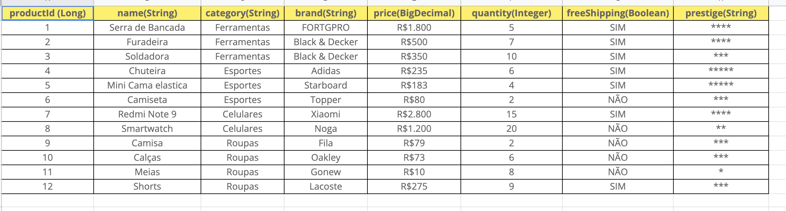

# spring-challenge
## Solução de desafio grupo03
### INTEGRANTES:
* Emanuelle Besckow Figueiredo
* Pedro Sol Barbosa Montes 
* Ana Gabriela Siqueira Franco 
* Douglas Santos Rodrigues 
* Renan Santana Sousa
* Willy de Jesus Passos

--

Projeto do desafio Java + Spring
## DESAFIO: REQUISITOS E APRESENTAÇÃO:
Uma plataforma de vendas de produtos online deseja melhorar as opções de pesquisa e
filtragem de seus produtos; Para isso, decidiu implementar um motor de busca que, a
partir das opções que o utilizador determina, devolve o(s) produto(s) que lhes
corresponde. Obs: Os produtos devem ser cadastrados a partir de um payload e
armazenados em um arquivo Json.
Para fazer isso, você precisa desenvolver uma API que forneça:
* 1. Cadastrar uma lista de produtos.
* 2. Uma lista de todos os produtos disponíveis.
* 3. Uma lista de produtos filtrados por categoria.
* 4. Uma lista que permite a combinação de qualquer um dos filtros. Por exemplo:
* categoria + frete grátis.
Por outro lado, uma vez que se pretende uma boa experiência do usuário no que diz respeito à forma de apresentação dos produtos, é necessário que os resultados fornecidos pela API possam ser ordenados por qualquer um dos seguintes critérios:

    

* 5. Alfabético (crescente e decrescente)
* 6. Preço mais alto
* 7. Menor preço

Ao mesmo tempo, é necessária uma API que forneça:
* 8. Possibilidade de envio de pedido de compra. A partir disso, o preço total da
requisição feita pode ser recebido como resposta.

● Leve em consideração, para cada uma dessas solicitações, os possíveis
"status code" que podem ser retornados. 

● Por exemplo:
* ○ Se um produto que não existe for solicitado, retorne o código de
status correspondente.
* Se houver um problema com o servidor e a conexão não puder ser
feita, o código de status correspondente deve ser retornado.
A plataforma forneceu a seguinte tabela de produtos iniciais que possui: 

    

##  Para acessar as funcionalidades da  API:

### Para Acessar os artigos disponiveis
* lista todos os artigos/produtos:
** GET: /api/v1/articles
* Uma lista de produtos filtrados por categoria.
** GET: /api/v1/articles?category=categoryName
* Uma lista que permite a combinação de qualquer um dos filtros. Por exemplo:
categoria + frete grátis. (Todas as combinações de 2 possíveis MENOS
quantidade)
** GET: /api/v1/articles?category=categoryName&freeShipping=true 

* Exemplo 2: Nome + Marca
** GET: /api/v1/articles?product=productName&brand=brandName
* Alfabético (crescente e decrescente)
** GET: /api/v1/articles?category=categoryName&freeShipping=true&order=0
** GET: /api/v1/articles?category=categoryName&freeShipping=true&order=1
* Maior preço
** GET: /api/v1/articles?category=categoryName&freeShipping=true&order=2
* Menor preço
** GET: /api/v1/articles?category=categoryName&freeShipping=true&order=3

### Para acessar solicitação de compras:

* Para solicitação de pedido: A solicitação receberá uma lista de produtos que será recuperada dos produtos já listados no estoque, utilizando o ID, e relacionando a quantidade solicitada para cálculo do valor total do pedido

** POST: /api/v1/order
* PAYLOAD: 

[
		{
			"productId":2,
			"name": "Mini Cama elastica",
			"brand": "Starboard",
			"quantity":6
		},
		{
			"productId":5,
			"name":"teste5",
			"brand":"blablabdddla",
			"quantity":5
		}		
	]

* RESPONSE: 

    {
	"id": -3751098563661413935,
	"products": [
		{
			"name": "Furadeira",
			"category": "Ferramentas",
			"brand": "Black & Decker",
			"price": 500,
			"quantity": 6,
			"prestige": "****",
			"productId": 2,
			"freeShipping": true
		},
		{
			"name": "Mini Cama elastica",
			"category": "Esportes",
			"brand": "Starboard",
			"price": 183,
			"quantity": 5,
			"prestige": "*****",
			"productId": 5,
			"freeShipping": true
		}
	],
	"total": 3915.0
}

### Para Acessar os pedidos/oreders disponiveis
* lista todos os pedidos/orders :
** GET: /api/v1/order

OBSERVAÇÃO: A LISTA INICIAL DE PRODUTOS JÁ ESTÁ CADASTRADA

